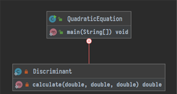

# Объектно-ориентированное программирование в Java
Сформировать навыки работы с основными конструкциями ООП языка Java.
Освоить принципы применения базовых объектных технологий java.
**Задание. Напишите программу на языке Java, в которой продемонстрируйте
работу основных принципов ООП.**

## 1. Разработайте класс для решения квадратных уравнений
Вычисление дискриминанта должен осуществлять вложенный класс. После компиляции объясните структуру class файлов. 
Проанализируйте использование вложенного класса.

После компиляции _class_ файлы выглядят следующим образом:

Имя файла вложенного класса начинается с имени класса, в который он вложен; после чего идет знак $ и имя вложенного класса. \
Диаграмма классов выглядит следующим образом:

  

## 2. Реализуйте игру в кости
Играют N игроков (компьютер в списке последний).
Подкидываются одновременно К кубиков. Выигрывает тот, у кого большая
сумма очков. Кто выиграл, тот и кидает первым в следующем кону. Игра идет
до 7 выигрышей. Начинаете игру Вы.

## 3. Напишите программу «Адрес человека».
Есть сущность Человек, которая
связана с сущностью Адрес. Считается, что у каждого человека есть только
один адрес. Организовать массив объектов Человек (не менее 4) и по массиву:
* осуществить поиск Человека по фамилии;
* осуществить поиск человека по атрибуту адреса;
* вывести людей, родившихся между определенными датами;
* найти самого старого (молодого);
* найти людей, проживающих на одной улице.